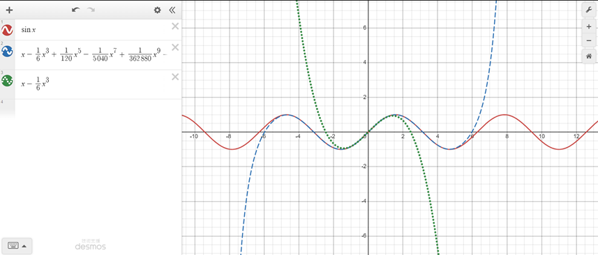

# 用程式求近似值(三角函數、尤拉數)

## 一、前言

　　在上數學課的微分的單元時，老師講述三角函數sinx及cosx在x趨近於0時的泰勒展開式，覺得很有趣，但沒有詳加介紹。好奇心驅使了我，想知道用程式執行的結果，所以便有了動手實作的想法。

## 二、泰勒展開式

設 f(x) 為 x 的 n 次多項式，a ∈ R，且 f(x) 在 x = a 處各階倒數存在， 則 f(x) 可表為 (x - a) 的泰勒展開式。

$$ f(x) = f(a) + \frac {f'(a)} {1!} (x-a) +  \frac {f''2(a)} {2!} (x-a)^2 + ... + \frac {f^n(x)} {n!} (x-a)^n $$


而我程式的主要內容為利用高次的泰勒展開式求出近似的 sinx、cosx 的值

使用的語言為python，整體流程為:
1.	建立階乘表
2.	直接將多項式逐一相加

運算後，我再利用google網上的計算機進行計算並和我的答案比對。

## 三、sinx 與 cosx 值的計算

### sinx 和 cosx 在 x = 0 處的泰勒展開式

$$ sinx = x - \frac {x^3} {3!} +  \frac {x^5} {5!} - \frac {x^7} {7!} + ... $$
 
$$ cosx = 1 - \frac {x^2} {2!} +  \frac {x^4} {4!} - \frac {x^6} {6!} + ... $$

### 延伸至廣義角
 
在最初，我的程式碼編寫只有聚焦在 x = 0 附近，但若展開到高次後，**我發現在－π < x < π 之間的值非常準確**

由於 sinx 和 cosx 的週期為 2π ，故後來我將在範圍外之 x，以同位角換算成－π < x < π 的範圍內，再進行計算，以達到能夠計算廣義角的功能。

### 程式碼

```python
import math
def factorial(num):
    if num == 0 or num == 1:
        return 1
    else:
        return factorial(num-1) * num
my_factorial = [1]
for _ in range(1, 151):
    my_factorial.append(factorial(_))
# 建立階乘表

def sin(x):
    answer = 0
    for _ in range(1, 151, 2):
        if _ % 4 == 1:
            answer += (x**(_) / my_factorial[_])
        else:
            answer -= (x**(_) / my_factorial[_])
    return answer
# 將sin函數在x=0做泰勒展開式，算出近似值

def cos(x):
    answer = 0
    for _ in range(0, 150, 2):
        if _ % 4 == 0:
            answer += (x**(_) / my_factorial[_])
        else:
            answer -= (x**(_) / my_factorial[_])
    return answer
# 將cos函數在x=0做泰勒展開式，算出近似值

pi = math.pi
print("Please input x: ", end="")
x = float(input())
if x > pi or x < -pi:
    x = x % (2*pi)

print(f"sinx = {sin(x):.11f}")
print(f"cosx = {cos(x):.11f}")
```

### 測試結果

```bash
Please input x: 5
sinx = -0.95892427466
cosx = 0.28366218546
```

### Google 計算機

```
sinx = -0.95892427466
cosx = 0.28366218546
```

### 反思

**1. 低次泰勒展開，sinx、cosx 當 x 趨近於 0 時，準確度尤佳。**
**2. 以高次方泰勒展開式執行 sinx、cosx 精準度頗佳。**
3. 分析 sinx 循環圖形、sinx 泰勒展開式圖形，以 Desmos 繪圖計算機繪製 sinx、三項的泰勒展開式、十三項的泰勒展開式加以比較，得到以下圖形，分析如下:
 
> - 愈高次的泰勒展開式愈接近 sinx 原始圖形。
> - 無論高次或低次的泰勒展開式，在執行 sinx 時，當 x 趨近於 0 符合上述 1、2 點的結果。



## 四、尤拉數

### 定義

$$ e = \lim_{n \to \infty} \left( 1 + \frac {1} {n} \right)^n $$

尤拉數 e 為數學常數，是自然隊數函數的底數，而 $ e^x $ 亦可用泰勒展開式展開

$$ e^x = 1 + \frac {x} {1!} + \frac {x^2} {2!} + \frac {x^3} {3!} + ... $$

當 x 代 1 時，即可求得 e 的近似值

$$ e = 1 + \frac {1} {1!} + \frac {1} {2!} + \frac {1} {3!} + ... $$


### 程式碼

```python
def factorial(num):
    if num == 0 or num == 1:
        return 1
    else:
        return factorial(num-1) * num
my_factorial = [1]
for _ in range(1, 151):
    my_factorial.append(factorial(_))
# 建立階乘表

def e():
    answer = 0
    for each_number in my_factorial:
        answer += (1 / each_number)
    return answer
# 利用尤拉函數做泰勒展開，算出e的近似值

print(f"e = {e()}")
```

### 測試結果

```bash
e = 2.7182818284590455
```

### Google 計算機

```
e = 2.718281828459045
```

### 反思

尤拉數是無限不循環小數，現在我利用程式描述泰勒展開式，去求取其近似值，與所查詢到的數字十分逼近，**顯示我的程式書寫方式確實可行。**

## 五、心得:

　　300多年前，英國數學家布魯克泰勒提出了泰勒展開式，引領了那一代數學相關知識的風潮，延續至今，仍是數學理論上學習的濫觴，而在今日，我們竟可以簡易的程式及軟體，碰觸這些艱深難懂之數學理論，並更深刻的學習它，從中得到啟發並做為充實自己的養分。

　　程式的學習，好似在製作一台時光機，可乘坐著它回到過去的任何年代，領略那些先知哲人的偉大創作，期待在更深更廣的學習精進下，能夠創造通往未來屬於我們這一代的最佳工具。
